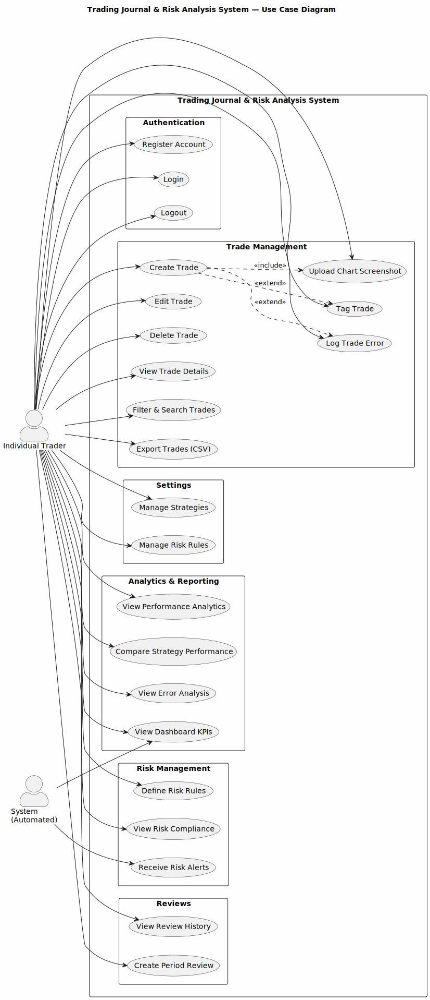
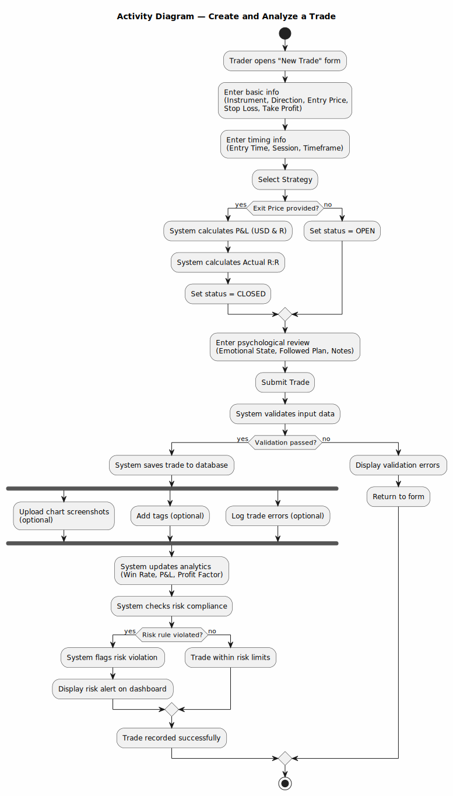
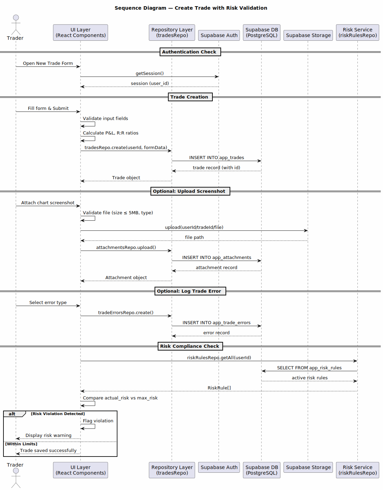
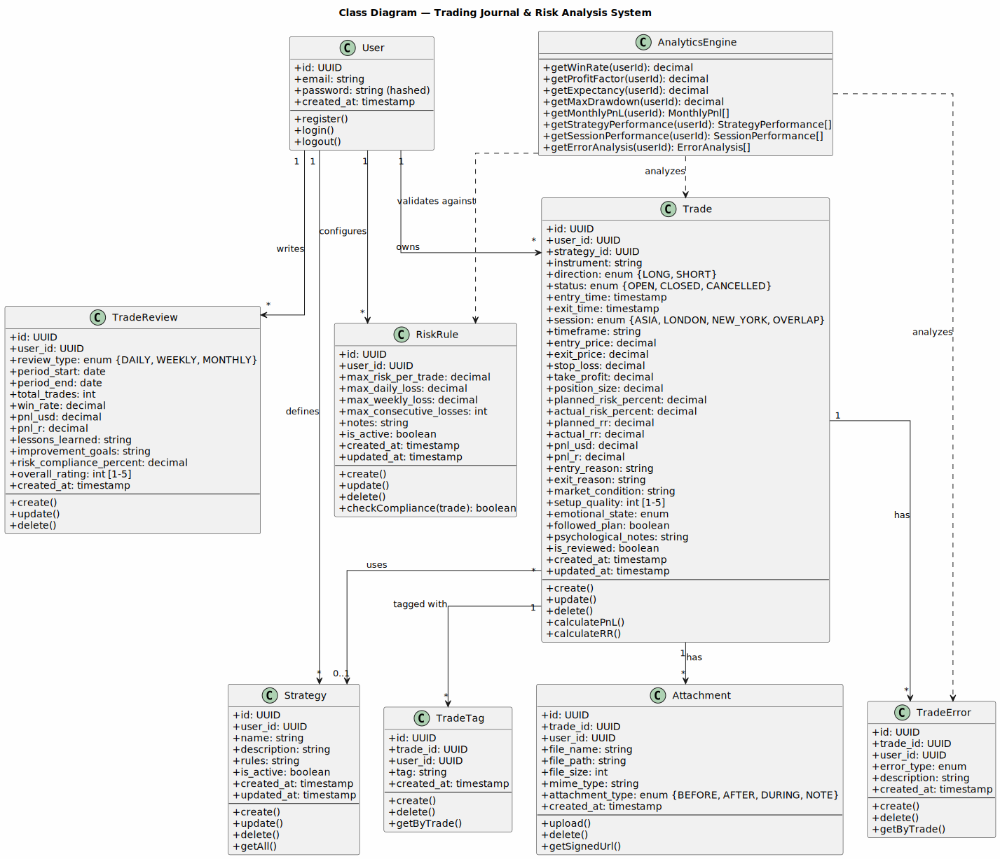

# Software Requirements Specification (SRS)

## Trading Journal & Risk Analysis System

---

**Document Version:** 1.0  
**Date:** April 14, 2026  
**Course:** Software Engineering 1  
**Prepared by:** Development Team  

---

## Table of Contents

1. [Introduction](#1-introduction)
2. [Stakeholders & Users](#2-stakeholders--users)
3. [System Overview](#3-system-overview)
4. [Functional Requirements](#4-functional-requirements)
5. [Non-Functional Requirements](#5-non-functional-requirements)
6. [Use Case Diagram](#6-use-case-diagram)
7. [Use Case Descriptions](#7-use-case-descriptions)
8. [UML Diagrams](#8-uml-diagrams)
9. [Conclusion & Future Work](#9-conclusion--future-work)

---

## 1. Introduction

### 1.1 Purpose of the System

The **Trading Journal & Risk Analysis System** is a professional web-based platform designed to help individual traders systematically record, analyze, and improve their trading performance. The system goes beyond simple trade logging by providing comprehensive analytics, risk compliance monitoring, psychological pattern tracking, and strategy performance comparison.

The core philosophy of the system is: **A trade is not just a profit or loss number — it is an event that can be analyzed and learned from.**

### 1.2 Problem Statement

Individual traders face several critical challenges that directly impact their profitability and growth:

| Problem | Impact |
|---------|--------|
| Traders do not know exactly what causes their losses | Repeated mistakes without awareness |
| No way to compare which strategies perform best | Suboptimal strategy selection |
| Failure to adhere to predefined risk rules | Account drawdowns and blown accounts |
| Loss of historical trade data and analysis | Inability to learn from past trades |
| No holistic view of trading performance | Lack of data-driven decision making |

Current solutions in the market are either too simplistic (spreadsheets) or too complex and expensive (institutional platforms). There is a clear gap for a professional yet accessible trading journal that combines trade logging with behavioral analytics and risk management.

### 1.3 Scope of the Project

**In Scope:**
- Single user account per trader
- Support for Spot, Forex, and Cryptocurrency instruments
- Full CRUD operations for trades, strategies, and risk rules
- Chart screenshot uploads (max 5MB per image, JPEG/PNG/WebP)
- Performance analytics with statistical indicators
- Risk compliance monitoring and alerts
- Trade error classification and analysis
- Periodic reviews (daily, weekly, monthly)
- CSV data export
- Responsive web interface with dark theme
- Deployment on Vercel with Supabase backend

**Out of Scope:**
- Direct integration with trading platforms (broker APIs)
- Automated/algorithmic trading
- Multi-account management within a single session
- Mobile native applications (iOS/Android)
- Real-time market data feeds
- Social/community features

### 1.4 Target Users

The primary target user is an **individual retail trader** who:
- Manages one or more trading accounts across Forex, Crypto, or Stock markets
- Follows structured trading methodologies (e.g., Smart Money Concepts, Price Action, ICT)
- Needs to track daily, weekly, and monthly performance
- Wants to understand which strategies are most profitable and under what market conditions
- Seeks to measure adherence to risk management plans and identify deviations
- Values data-driven self-improvement over intuition-based trading

---

## 2. Stakeholders & Users

### 2.1 Actors Identification

| Actor | Type | Description |
|-------|------|-------------|
| **Individual Trader** | Primary User | The main user of the system. Registers an account, logs trades, reviews performance, manages strategies and risk rules, and uses analytics to improve trading decisions. |
| **System (Automated)** | System Actor | The automated backend that performs calculations (P&L, R-multiples, win rate), enforces data validation, checks risk compliance, generates analytics views, and manages file storage security. |
| **Supabase Auth Service** | External System | Handles user authentication, session management, and JWT token generation. Enforces Row Level Security (RLS) policies at the database level. |
| **Supabase Storage** | External System | Manages secure file uploads and retrieval for chart screenshots. Provides signed URLs for private file access. |
| **Vercel Platform** | External System | Hosts the frontend application, handles CDN distribution, and manages environment-based deployments. |

### 2.2 Actor Roles & Responsibilities

**Individual Trader:**
- Register and authenticate into the system
- Create, read, update, and delete trades with full metadata
- Upload chart screenshots as trade attachments
- Define and manage trading strategies
- Configure risk management rules and thresholds
- Review performance analytics and dashboards
- Create periodic reviews (daily/weekly/monthly)
- Export trade data to CSV format
- Tag trades and log trading errors for pattern analysis

**System (Automated):**
- Calculate P&L in USD and R-multiples upon trade creation/update
- Compute Risk-to-Reward ratios (planned and actual)
- Aggregate analytics data (win rate, profit factor, expectancy)
- Validate input data against defined constraints
- Enforce Row Level Security — each user sees only their own data
- Generate signed URLs for secure file access
- Maintain database indexes for query performance

---

## 3. System Overview

### 3.1 High-Level Architecture

The Trading Journal & Risk Analysis System follows a **layered architecture** with clear separation of concerns:

```
┌─────────────────────────────────────────────────┐
│                  PRESENTATION LAYER              │
│         React + TypeScript + Tailwind CSS         │
│         (shadcn/ui Component Library)             │
├─────────────────────────────────────────────────┤
│                DATA ACCESS LAYER                 │
│         Repository Pattern (repository.ts)        │
│         Type-safe Supabase Client                 │
├─────────────────────────────────────────────────┤
│                  BACKEND LAYER                   │
│         Supabase (PostgreSQL + Auth + Storage)    │
│         Row Level Security (RLS)                  │
│         SQL Views for Analytics                   │
├─────────────────────────────────────────────────┤
│                INFRASTRUCTURE LAYER              │
│         Vercel (Hosting & CDN)                    │
│         Supabase Cloud (Database & Auth)          │
└─────────────────────────────────────────────────┘
```

### 3.2 How the System Works

1. **Authentication:** A trader registers or logs in via email/password. Supabase Auth issues a JWT token that is stored in the browser session. All subsequent API calls include this token.

2. **Trade Management:** The trader fills out a comprehensive trade form with instrument details, price data, timing, strategy selection, and psychological notes. Upon submission, the system automatically calculates P&L (in USD and R-multiples), Risk-to-Reward ratios, and sets the trade status.

3. **File Attachments:** Traders can upload chart screenshots (before/after/during trade). Files are stored in Supabase Storage under a private bucket organized by `{user_id}/{trade_id}/`. Access is controlled via signed URLs.

4. **Analytics Engine:** The system aggregates closed trades to compute key performance indicators: Win Rate, Profit Factor, Average Win/Loss in R, Maximum Drawdown, and Expectancy. A pre-computed SQL View (`app_trade_summary`) accelerates dashboard loading.

5. **Risk Compliance:** The system compares each trade's actual risk percentage against the trader's defined risk rules. Violations are flagged and displayed on the Risk Review dashboard.

6. **Error Tracking:** Traders classify mistakes on each trade (e.g., FOMO Entry, Moved Stop Loss, Revenge Trade). The system tracks error frequency and trends over time to help identify behavioral patterns.

7. **Periodic Reviews:** Traders create daily, weekly, or monthly reviews summarizing their performance, lessons learned, and improvement goals.

### 3.3 Technology Stack

| Component | Technology | Purpose |
|-----------|-----------|---------|
| Frontend Framework | React 18 + TypeScript | UI rendering and state management |
| UI Library | shadcn/ui + Tailwind CSS | Component library and styling |
| Routing | React Router v6 | Client-side navigation |
| Backend/Database | Supabase (PostgreSQL) | Data storage, authentication, file storage |
| Security | Row Level Security (RLS) | Data isolation per user |
| Deployment | Vercel | Hosting and CDN |
| Charts | Recharts | Data visualization |

---

## 4. Functional Requirements

### 4.1 Authentication Module

| ID | Requirement |
|----|-------------|
| FR-AUTH-01 | The system shall allow users to register a new account using email and password. |
| FR-AUTH-02 | The system shall allow registered users to log in using email and password. |
| FR-AUTH-03 | The system shall allow authenticated users to log out and terminate their session. |
| FR-AUTH-04 | The system shall redirect unauthenticated users to the login page when accessing protected routes. |
| FR-AUTH-05 | The system shall maintain user sessions using JWT tokens managed by Supabase Auth. |
| FR-AUTH-06 | The system shall enforce that each user can only access their own data through Row Level Security. |

### 4.2 Trade Management Module

| ID | Requirement |
|----|-------------|
| FR-TRADE-01 | The system shall allow users to create a new trade with the following required fields: instrument, direction (LONG/SHORT), entry price, stop loss, and entry time. |
| FR-TRADE-02 | The system shall allow users to provide optional trade fields: exit price, take profit, position size, exit time, session, timeframe, strategy, and psychological notes. |
| FR-TRADE-03 | The system shall automatically calculate P&L in USD when both entry price, exit price, and position size are provided. |
| FR-TRADE-04 | The system shall automatically calculate P&L in R-multiples based on the risk per unit (entry price minus stop loss). |
| FR-TRADE-05 | The system shall automatically calculate planned R:R ratio when take profit and stop loss are provided. |
| FR-TRADE-06 | The system shall automatically calculate actual R:R ratio when exit price is provided. |
| FR-TRADE-07 | The system shall set trade status to CLOSED when an exit price is provided, and OPEN otherwise. |
| FR-TRADE-08 | The system shall allow users to edit existing trades and recalculate derived fields. |
| FR-TRADE-09 | The system shall allow users to delete trades with cascading deletion of related errors, tags, and attachments. |
| FR-TRADE-10 | The system shall display a paginated list of trades with server-side pagination (default 50 per page). |
| FR-TRADE-11 | The system shall allow users to filter trades by status, direction, session, instrument, strategy, and date range. |
| FR-TRADE-12 | The system shall allow users to view detailed information for a single trade on a dedicated detail page. |
| FR-TRADE-13 | The system shall allow users to record their emotional state for each trade (CALM, ANXIOUS, CONFIDENT, FOMO, REVENGE, NEUTRAL). |
| FR-TRADE-14 | The system shall allow users to indicate whether they followed their trading plan for each trade. |
| FR-TRADE-15 | The system shall allow users to rate setup quality on a scale of 1 to 5. |
| FR-TRADE-16 | The system shall allow users to export filtered trades to CSV format. |

### 4.3 Trade Error Tracking Module

| ID | Requirement |
|----|-------------|
| FR-ERR-01 | The system shall allow users to log one or more errors per trade. |
| FR-ERR-02 | The system shall support the following error types: FOMO_ENTRY, EARLY_EXIT, LATE_EXIT, OVERSIZE_POSITION, NO_CLEAR_SETUP, MOVED_STOP_LOSS, REVENGE_TRADE, IGNORED_RISK_RULE, POOR_TIMING, OTHER. |
| FR-ERR-03 | The system shall allow users to add a text description to each error. |
| FR-ERR-04 | The system shall allow users to delete logged errors. |

### 4.4 Trade Tags Module

| ID | Requirement |
|----|-------------|
| FR-TAG-01 | The system shall allow users to add custom text tags to trades. |
| FR-TAG-02 | The system shall allow users to remove tags from trades. |
| FR-TAG-03 | The system shall display all tags associated with a trade on the trade detail page. |

### 4.5 Attachments Module

| ID | Requirement |
|----|-------------|
| FR-ATT-01 | The system shall allow users to upload chart screenshots for each trade. |
| FR-ATT-02 | The system shall enforce a maximum file size of 5MB per upload. |
| FR-ATT-03 | The system shall accept only JPEG, PNG, and WebP image formats. |
| FR-ATT-04 | The system shall classify attachments by type: BEFORE, AFTER, DURING, or NOTE. |
| FR-ATT-05 | The system shall store files in a private storage bucket organized by user_id/trade_id. |
| FR-ATT-06 | The system shall generate signed URLs (valid for 60 minutes) for viewing attachments. |
| FR-ATT-07 | The system shall allow users to delete attachments (removing both the file and database record). |

### 4.6 Strategy Management Module

| ID | Requirement |
|----|-------------|
| FR-STRAT-01 | The system shall allow users to create trading strategies with name, description, and rules. |
| FR-STRAT-02 | The system shall allow users to edit existing strategies. |
| FR-STRAT-03 | The system shall allow users to delete strategies (trades referencing deleted strategies retain NULL reference). |
| FR-STRAT-04 | The system shall allow users to activate or deactivate strategies. |
| FR-STRAT-05 | The system shall display a list of all user strategies sorted alphabetically. |

### 4.7 Risk Management Module

| ID | Requirement |
|----|-------------|
| FR-RISK-01 | The system shall allow users to define risk rules with: max risk per trade (%), max daily loss (%), max weekly loss (%), and max consecutive losses. |
| FR-RISK-02 | The system shall allow users to create, edit, and delete risk rules. |
| FR-RISK-03 | The system shall allow users to activate or deactivate risk rules. |
| FR-RISK-04 | The system shall calculate risk compliance percentage by comparing actual trade risk against defined rules. |
| FR-RISK-05 | The system shall display risk compliance metrics on the Risk Review page. |
| FR-RISK-06 | The system shall flag trades that violate defined risk rules. |

### 4.8 Analytics Module

| ID | Requirement |
|----|-------------|
| FR-ANAL-01 | The system shall calculate and display Win Rate (percentage of winning trades among closed trades). |
| FR-ANAL-02 | The system shall calculate and display Profit Factor (sum of wins / absolute sum of losses). |
| FR-ANAL-03 | The system shall calculate and display Average Win (in R-multiples) and Average Loss (in R-multiples). |
| FR-ANAL-04 | The system shall calculate and display total P&L in both USD and R-multiples. |
| FR-ANAL-05 | The system shall calculate and display Maximum Drawdown in R-multiples. |
| FR-ANAL-06 | The system shall calculate and display Maximum Consecutive Wins and Losses. |
| FR-ANAL-07 | The system shall calculate and display Expectancy (expected R per trade). |
| FR-ANAL-08 | The system shall display performance breakdown by strategy. |
| FR-ANAL-09 | The system shall display performance breakdown by trading session (Asia, London, New York, Overlap). |
| FR-ANAL-10 | The system shall display monthly P&L trends as a chart. |
| FR-ANAL-11 | The system shall display error frequency analysis showing the most common trading mistakes. |
| FR-ANAL-12 | The system shall use a pre-computed SQL View (app_trade_summary) for fast dashboard loading. |

### 4.9 Trade Reviews Module

| ID | Requirement |
|----|-------------|
| FR-REV-01 | The system shall allow users to create periodic reviews (DAILY, WEEKLY, MONTHLY). |
| FR-REV-02 | The system shall allow users to specify period start and end dates for each review. |
| FR-REV-03 | The system shall allow users to record: total trades, win rate, P&L (USD and R), lessons learned, improvement goals, risk compliance percentage, and overall rating (1-5). |
| FR-REV-04 | The system shall allow users to edit and delete reviews. |
| FR-REV-05 | The system shall display reviews sorted by period start date (newest first). |

### 4.10 Dashboard Module

| ID | Requirement |
|----|-------------|
| FR-DASH-01 | The system shall display key performance indicators (KPIs) as cards at the top of the dashboard. |
| FR-DASH-02 | The system shall display the most recent 5 trades on the dashboard. |
| FR-DASH-03 | The system shall display a performance chart for the last 30 days. |
| FR-DASH-04 | The system shall display risk compliance alerts when violations are detected. |

---

## 5. Non-Functional Requirements

### 5.1 Security

| ID | Requirement |
|----|-------------|
| NFR-SEC-01 | The system shall enforce Row Level Security (RLS) on all database tables, ensuring each user can only access their own data. |
| NFR-SEC-02 | The system shall never expose API keys, database credentials, or service role keys in client-side code. |
| NFR-SEC-03 | The system shall use JWT-based authentication managed by Supabase Auth. |
| NFR-SEC-04 | The system shall store file attachments in a private storage bucket with access controlled via signed URLs. |
| NFR-SEC-05 | The system shall validate all user inputs on the client side before submission. |
| NFR-SEC-06 | The system shall use HTTPS for all communications. |

### 5.2 Performance

| ID | Requirement |
|----|-------------|
| NFR-PERF-01 | The system shall implement server-side pagination for trade listings (default 50 records per page). |
| NFR-PERF-02 | The system shall use pre-computed SQL Views for analytics calculations to reduce query time. |
| NFR-PERF-03 | The system shall create database indexes on frequently queried columns (user_id, entry_time, strategy_id, status). |
| NFR-PERF-04 | The dashboard page shall load within 3 seconds on a standard broadband connection. |
| NFR-PERF-05 | File uploads shall be limited to 5MB to maintain upload performance. |

### 5.3 Usability

| ID | Requirement |
|----|-------------|
| NFR-USE-01 | The system shall provide a dark-themed interface optimized for extended use. |
| NFR-USE-02 | The system shall be responsive and functional on desktop, tablet, and mobile devices. |
| NFR-USE-03 | The system shall use clear visual indicators for profit (green) and loss (red) values. |
| NFR-USE-04 | The system shall use monospace fonts for numerical/financial data for improved readability. |
| NFR-USE-05 | The system shall provide clear error messages when operations fail. |
| NFR-USE-06 | The system shall provide intuitive navigation via a sidebar menu. |

### 5.4 Availability

| ID | Requirement |
|----|-------------|
| NFR-AVL-01 | The system shall be available 99.9% of the time (dependent on Supabase and Vercel SLAs). |
| NFR-AVL-02 | The system shall gracefully handle backend unavailability by displaying appropriate error messages. |
| NFR-AVL-03 | The system shall maintain functionality during Supabase free-tier rate limits. |

### 5.5 Scalability

| ID | Requirement |
|----|-------------|
| NFR-SCL-01 | The system shall follow a modular architecture allowing new features to be added without restructuring existing code. |
| NFR-SCL-02 | The system shall use a Repository pattern to abstract database access, enabling future backend migration if needed. |
| NFR-SCL-03 | The database schema shall support efficient querying for users with up to 10,000 trades. |
| NFR-SCL-04 | The system shall be deployable to Vercel with zero code changes — only environment variables need to be configured. |

---

## 6. Use Case Diagram

The following Use Case Diagram illustrates the interactions between the system actors and the main functionalities of the Trading Journal & Risk Analysis System.



**Diagram Description:**

The diagram shows two actors:
- **Individual Trader** (primary actor) — interacts with all system modules
- **System (Automated)** — performs automated calculations and risk monitoring

The use cases are organized into six packages:
1. **Authentication** — Register, Login, Logout
2. **Trade Management** — Full CRUD, filtering, attachments, tags, errors, CSV export
3. **Analytics & Reporting** — Dashboard KPIs, performance analytics, strategy comparison, error analysis
4. **Risk Management** — Define rules, view compliance, receive alerts
5. **Reviews** — Create and view periodic reviews
6. **Settings** — Manage strategies and risk rules

Key relationships:
- Creating a trade **includes** the option to upload screenshots
- Creating a trade **extends** to optionally adding tags and logging errors

---

## 7. Use Case Descriptions

### 7.1 UC-01: Register Account

| Field | Description |
|-------|-------------|
| **Use Case ID** | UC-01 |
| **Name** | Register Account |
| **Actor** | Individual Trader |
| **Precondition** | User does not have an existing account |
| **Postcondition** | A new user account is created and the user is redirected to the dashboard |
| **Main Flow** | 1. User navigates to the registration page. 2. User enters email address and password. 3. System validates email format and password strength. 4. System creates the account via Supabase Auth. 5. System redirects user to the dashboard. |
| **Alternative Flow** | 3a. If email is already registered, system displays "Email already in use" error. 3b. If password is too weak, system displays password requirements. |
| **Exception Flow** | If Supabase Auth service is unavailable, system displays a connection error message. |

### 7.2 UC-04: Create Trade

| Field | Description |
|-------|-------------|
| **Use Case ID** | UC-04 |
| **Name** | Create Trade |
| **Actor** | Individual Trader |
| **Precondition** | User is authenticated |
| **Postcondition** | A new trade record is saved with calculated P&L and R:R values |
| **Main Flow** | 1. User navigates to "New Trade" page. 2. User fills in required fields: instrument, direction, entry price, stop loss, entry time. 3. User optionally fills: exit price, take profit, position size, strategy, session, timeframe, emotional state, setup quality, notes. 4. User clicks "Save Trade". 5. System validates all input fields. 6. System calculates P&L (USD), P&L (R), planned R:R, and actual R:R. 7. System determines trade status (OPEN if no exit price, CLOSED if exit price provided). 8. System saves the trade to the database. 9. System redirects to the trade detail page. |
| **Alternative Flow** | 5a. If validation fails, system highlights invalid fields with error messages. 6a. If position size is not provided, P&L calculations are skipped. |
| **Exception Flow** | If database insert fails, system displays an error and preserves form data. |

### 7.3 UC-09: Upload Chart Screenshot

| Field | Description |
|-------|-------------|
| **Use Case ID** | UC-09 |
| **Name** | Upload Chart Screenshot |
| **Actor** | Individual Trader |
| **Precondition** | User is authenticated and viewing a trade detail page |
| **Postcondition** | The screenshot is stored in Supabase Storage and linked to the trade |
| **Main Flow** | 1. User clicks "Upload Screenshot" on the trade detail page. 2. User selects an image file from their device. 3. User selects the attachment type (BEFORE, AFTER, DURING, NOTE). 4. System validates file type (JPEG/PNG/WebP) and size (≤ 5MB). 5. System uploads the file to Supabase Storage at path `{user_id}/{trade_id}/{timestamp}-{filename}`. 6. System creates an attachment record in the database. 7. System displays the uploaded image using a signed URL. |
| **Alternative Flow** | 4a. If file exceeds 5MB, system displays "File size exceeds 5MB limit" error. 4b. If file type is not allowed, system displays "Only JPEG, PNG, and WebP images are allowed" error. |

### 7.4 UC-13: View Dashboard KPIs

| Field | Description |
|-------|-------------|
| **Use Case ID** | UC-13 |
| **Name** | View Dashboard KPIs |
| **Actor** | Individual Trader, System (Automated) |
| **Precondition** | User is authenticated |
| **Postcondition** | Dashboard displays current performance metrics |
| **Main Flow** | 1. User navigates to the Dashboard page. 2. System queries the `app_trade_summary` view for the user's aggregated metrics. 3. System fetches the 5 most recent trades. 4. System checks risk compliance against active risk rules. 5. System renders KPI cards (Total Trades, Win Rate, Total P&L, Profit Factor). 6. System renders the recent trades list. 7. System renders performance chart for the last 30 days. 8. If risk violations exist, system displays alert notifications. |
| **Alternative Flow** | 2a. If user has no trades, system displays an empty state with a prompt to create the first trade. |

### 7.5 UC-17: Define Risk Rules

| Field | Description |
|-------|-------------|
| **Use Case ID** | UC-17 |
| **Name** | Define Risk Rules |
| **Actor** | Individual Trader |
| **Precondition** | User is authenticated |
| **Postcondition** | A new risk rule is saved and active for compliance checking |
| **Main Flow** | 1. User navigates to Settings > Risk Rules. 2. User clicks "Add Risk Rule". 3. User enters: max risk per trade (%), max daily loss (%), max weekly loss (%), max consecutive losses, and optional notes. 4. User clicks "Save". 5. System validates input values. 6. System saves the risk rule to the database with is_active = true. 7. System displays the updated list of risk rules. |
| **Alternative Flow** | 5a. If max risk per trade is not provided, system uses default value of 1.0%. |

### 7.6 UC-20: Create Period Review

| Field | Description |
|-------|-------------|
| **Use Case ID** | UC-20 |
| **Name** | Create Period Review |
| **Actor** | Individual Trader |
| **Precondition** | User is authenticated |
| **Postcondition** | A new review record is saved |
| **Main Flow** | 1. User navigates to the Reviews page. 2. User clicks "New Review". 3. User selects review type (DAILY, WEEKLY, MONTHLY). 4. User specifies period start and end dates. 5. User enters: total trades, win rate, P&L, lessons learned, improvement goals, risk compliance %, and overall rating (1-5). 6. User clicks "Save Review". 7. System saves the review to the database. 8. System displays the updated review list. |

---

## 8. UML Diagrams

### 8.1 Use Case Diagram

The Use Case Diagram provides a high-level view of all system functionalities and their relationships with actors.


### 8.2 Activity Diagram

The Activity Diagram below illustrates the workflow for creating a trade and the subsequent automated processes including P&L calculation, attachment handling, and risk compliance checking.



**Key Decision Points:**
- **Exit Price Provided?** — Determines whether P&L is calculated and status is set to CLOSED
- **Validation Passed?** — Gates the save operation
- **Risk Rule Violated?** — Triggers risk alerts on the dashboard

**Parallel Activities:**
After a trade is saved, three optional activities can occur in parallel:
1. Upload chart screenshots
2. Add tags
3. Log trade errors

### 8.3 Sequence Diagram

The Sequence Diagram shows the interaction between system components during the trade creation process, including authentication verification, data persistence, file upload, and risk validation.



**Component Interactions:**
1. **UI Layer** → **Supabase Auth**: Verifies active session
2. **UI Layer** → **Repository Layer**: Delegates data operations
3. **Repository Layer** → **Supabase DB**: Executes SQL operations
4. **UI Layer** → **Supabase Storage**: Handles file uploads
5. **UI Layer** → **Risk Service**: Validates trade against risk rules

### 8.4 Class Diagram

The Class Diagram represents the data model and relationships between all entities in the system.



**Key Relationships:**
- **User** `1 → *` **Trade**: A user owns many trades
- **User** `1 → *` **Strategy**: A user defines many strategies
- **User** `1 → *` **RiskRule**: A user configures many risk rules
- **User** `1 → *` **TradeReview**: A user writes many reviews
- **Trade** `* → 0..1` **Strategy**: A trade optionally uses one strategy
- **Trade** `1 → *` **TradeError**: A trade can have many logged errors
- **Trade** `1 → *` **TradeTag**: A trade can have many tags
- **Trade** `1 → *` **Attachment**: A trade can have many attachments
- **AnalyticsEngine** `..>` **Trade, TradeError, RiskRule**: Analyzes data across entities

---

## 9. Conclusion & Future Work

### 9.1 Conclusion

The Trading Journal & Risk Analysis System addresses a critical gap in the retail trading ecosystem by providing a comprehensive, professional-grade tool for trade documentation, performance analysis, and behavioral improvement. The system's layered architecture ensures maintainability and extensibility, while Supabase's Row Level Security guarantees data isolation between users.

Key achievements of the system design:
- **Comprehensive data model** covering all aspects of trade analysis (financial, strategic, psychological)
- **Automated calculations** reducing manual effort and human error
- **Risk compliance monitoring** promoting disciplined trading behavior
- **Modular architecture** enabling incremental feature development
- **Secure by design** with RLS enforced at the database level

### 9.2 Future Work

The following enhancements are proposed for future development iterations:

| Priority | Feature | Description |
|----------|---------|-------------|
| High | **Broker API Integration** | Connect directly to trading platforms (MetaTrader, Binance, Interactive Brokers) to auto-import trades, eliminating manual entry. |
| High | **AI-Powered Trade Analysis** | Use machine learning to identify patterns in winning vs. losing trades, suggest optimal strategies, and predict risk of emotional trading. |
| Medium | **Multi-Account Support** | Allow traders to manage multiple trading accounts within a single dashboard with consolidated analytics. |
| Medium | **Advanced Charting** | Embed TradingView charts directly in the platform for in-app technical analysis alongside trade records. |
| Medium | **Notification System** | Push notifications and email alerts for risk rule violations, consecutive loss warnings, and review reminders. |
| Low | **Social/Community Features** | Allow traders to share anonymized performance reports, compare strategies, and participate in trading challenges. |
| Low | **Mobile Application** | Native iOS/Android app for on-the-go trade logging with camera integration for chart screenshots. |
| Low | **Backtesting Module** | Allow traders to test strategies against historical data before deploying them in live markets. |
| Low | **Journal/Notes System** | A dedicated journaling feature for daily market observations, pre-market analysis, and end-of-day reflections. |

---

## Appendix A: Database Schema Summary

| Table | Description | Key Columns |
|-------|-------------|-------------|
| `app_strategies` | Trading strategies defined by users | name, description, rules, is_active |
| `app_risk_rules` | Risk management rules and thresholds | max_risk_per_trade, max_daily_loss, max_weekly_loss |
| `app_trades` | Core trade records with full metadata | instrument, direction, prices, P&L, emotional_state |
| `app_trade_errors` | Classified trading mistakes per trade | error_type (10 categories), description |
| `app_trade_tags` | Custom tags for trade categorization | tag (free text) |
| `app_attachments` | Chart screenshots and trade images | file_path, attachment_type, mime_type |
| `app_trade_reviews` | Periodic performance reviews | review_type, period dates, lessons_learned |
| `app_trade_summary` (View) | Pre-computed analytics per user | win_rate, profit_factor, total_pnl |

## Appendix B: Glossary

| Term | Definition |
|------|-----------|
| **R-Multiple** | A measure of trade profit/loss relative to the initial risk. 1R = the amount risked; 2R = twice the risk gained. |
| **Win Rate** | Percentage of closed trades that resulted in a profit. |
| **Profit Factor** | Ratio of gross profits to gross losses. A value > 1 indicates profitability. |
| **Expectancy** | The average expected return per trade in R-multiples. |
| **Drawdown** | The peak-to-trough decline in account equity, measured in R-multiples. |
| **RLS (Row Level Security)** | A PostgreSQL feature that restricts row access based on the authenticated user. |
| **Stop Loss** | A predetermined price level at which a losing trade is closed to limit losses. |
| **Take Profit** | A predetermined price level at which a winning trade is closed to lock in gains. |
| **FOMO** | Fear Of Missing Out — entering a trade impulsively without proper analysis. |
| **Smart Money Concepts (SMC)** | A trading methodology based on tracking institutional order flow and market structure. |

---

*End of Document*